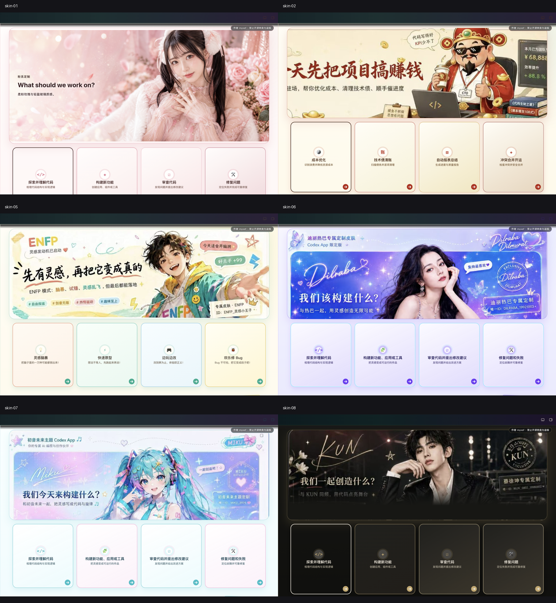
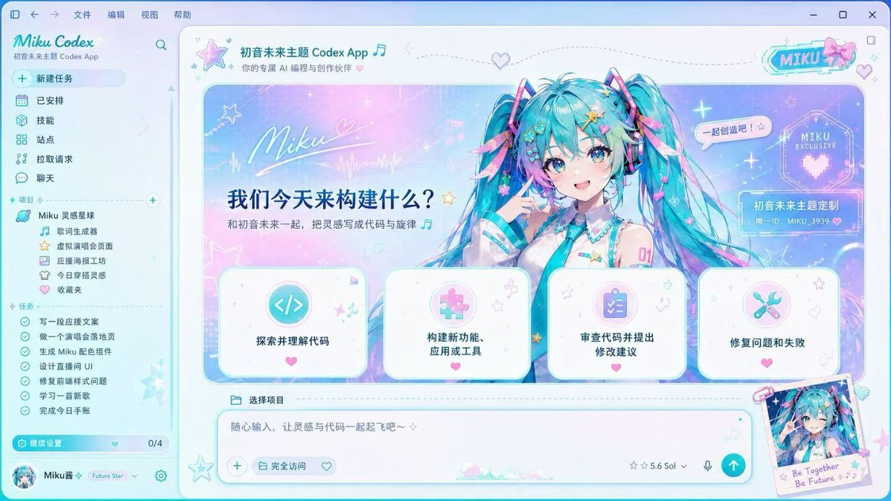

# Codex Theme Switch

  <a href="./README.md">中文</a> · <strong>English</strong>

  <strong>Give Codex a face that breathes.</strong> 
  External themes for the Codex desktop app · Local CDP inject · No official package mutation

  One image, one mood · Code with atmosphere

  Unofficial. Does not modify <code>.app</code> / <code>app.asar</code> / WindowsApps.

  
  

## Project & sponsorship

  <strong>Codex Theme Switch</strong> 
  Maintained by <a href="https://github.com/myxsf">myxsf</a> · No sponsors yet

This project is not sponsored by or affiliated with any API relay, service provider, or other commercial service. Any future sponsor will be disclosed here; unlisted third parties are unrelated to this project.

## Gallery

The first image is a privacy-cropped `2.2.10` live gallery containing only the
Hero and native suggestion-card regions:

  

One image, one mood. The images below are the matching prototype references:

   
  Pink Custom

   
  God of Wealth

   
  Red-White Sci-Fi

   
  Clear Custom

   
  Inspiration

   
  Purple Night

   
  Hatsune Miku

   
  Stage Black-Gold

## What it does

- **Real UI** — Sidebar, cards, project picker, and input stay native. Not a fake full-window screenshot.
- **Swappable art** — Drop in an image you like and it becomes your theme.
- **Restorable** — One-click restore to the stock look.
- **Safer path** — Local-loopback CDP inject only. No official binary or signature changes.

## What's new in 2.2.10

- Light themes now isolate native Codex tokens from a dark host shell, preventing black headers, dark output cards, and unreadable text.
- Removed the black gradient and dark band around the composer, with stronger contrast for the send button and its icon.
- When Windows blocks direct execution of the Store-packaged Node runtime, the installer copies and validates it in the current user's local runtime directory.

## Quick start

Platform scripts are ready — different plumbing, same goal: theme Codex.

| Platform | Dir | Entry |
|------|------|------|
| Apple Silicon / Intel Mac | [`macos/`](./macos/) | Double-click `Install Codex Dream Skin.command` |
| Windows | [`windows/`](./windows/) | `scripts/install-dream-skin.ps1` → `start-dream-skin.ps1` |

More detail:

- Mac: [`macos/README.md`](./macos/README.md)
- Windows: [`windows/SKILL.md`](./windows/SKILL.md)
- Paths: [`docs/platforms.md`](./docs/platforms.md)
- Project notes: [`docs/PROJECT.md`](./docs/PROJECT.md)
- `2.2.10` cross-platform install validation: [`docs/RELEASE-VALIDATION-v2.2.10.md`](./docs/RELEASE-VALIDATION-v2.2.10.md)

## Feedback & contributions

- **Issues:** Use the [issue templates](./.github/ISSUE_TEMPLATE/) (bug / feature). Blank issues are disabled. Please try Verify / Restore self-checks before filing bugs.
- **PRs:** Follow the [PR template](./.github/pull_request_template.md) — describe the change and tick the self-checks you actually ran (e.g. `macos/tests/run-tests.sh`, verify / restore).

## Safety

- CDP binds `127.0.0.1` only — avoid untrusted local processes while the theme runs.
- Does not touch the official install directory or code signature.
- **Never** rewrites API Key / Base URL; relay and theme stay separate.

## License

- Software source is licensed under [`LICENSE`](./LICENSE) (MIT)
- People, characters, QQ-inspired material, and brand assets are excluded from the code license; read [`ASSET_RIGHTS.md`](./ASSET_RIGHTS.md) before redistribution
- Unofficial; Codex and related rights belong to their owners.
- People / IP art in previews is illustrative only — clear rights before commercial redistribution.

---

Star it, pick a look, and make Codex yours for today.
